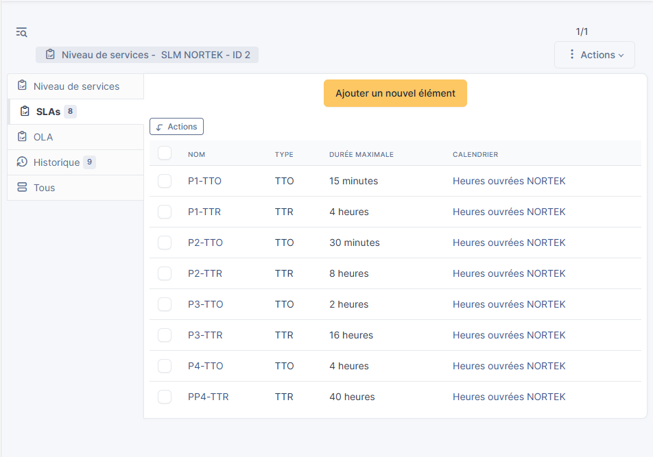
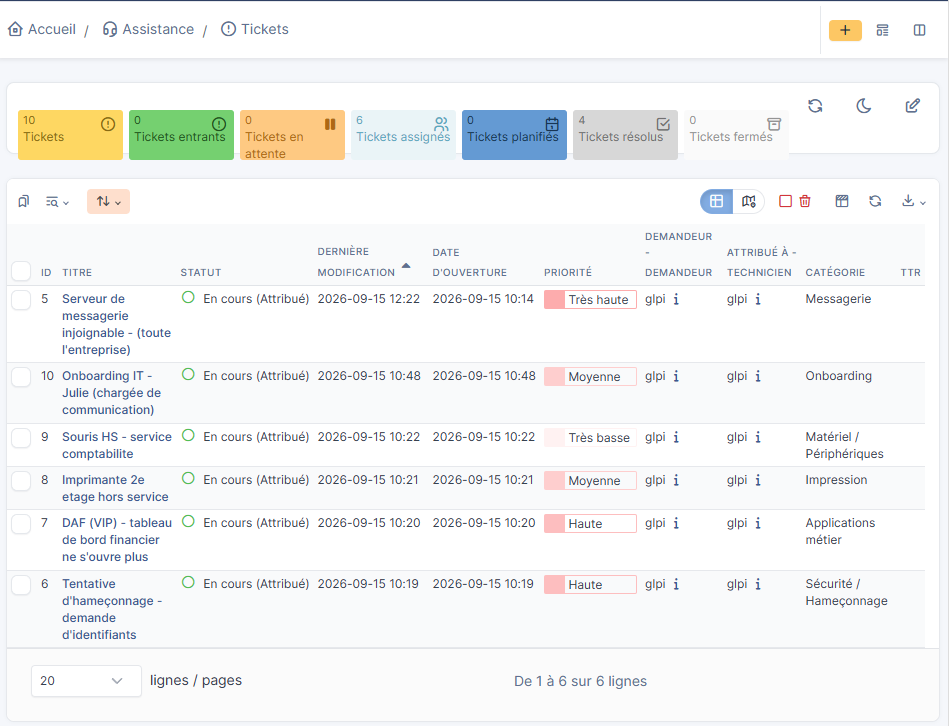
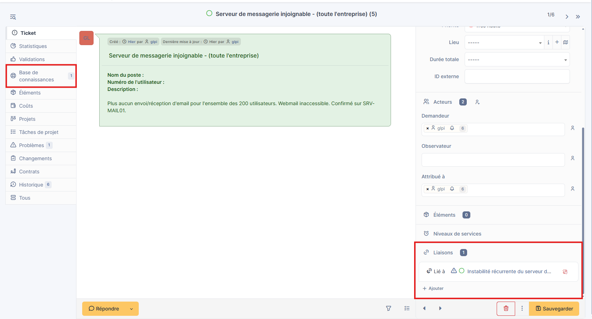
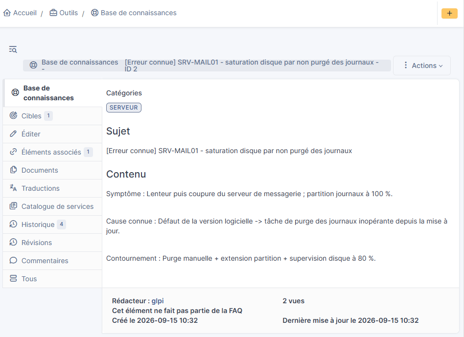
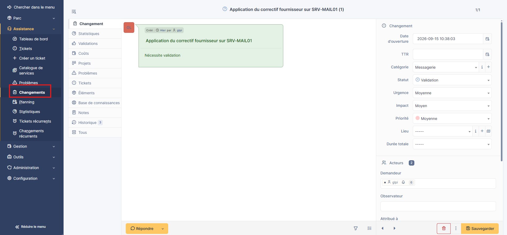
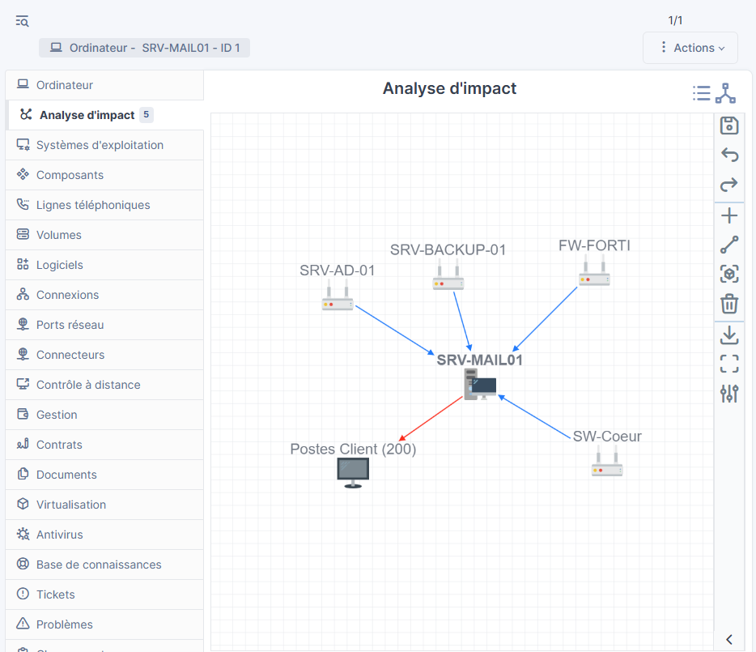
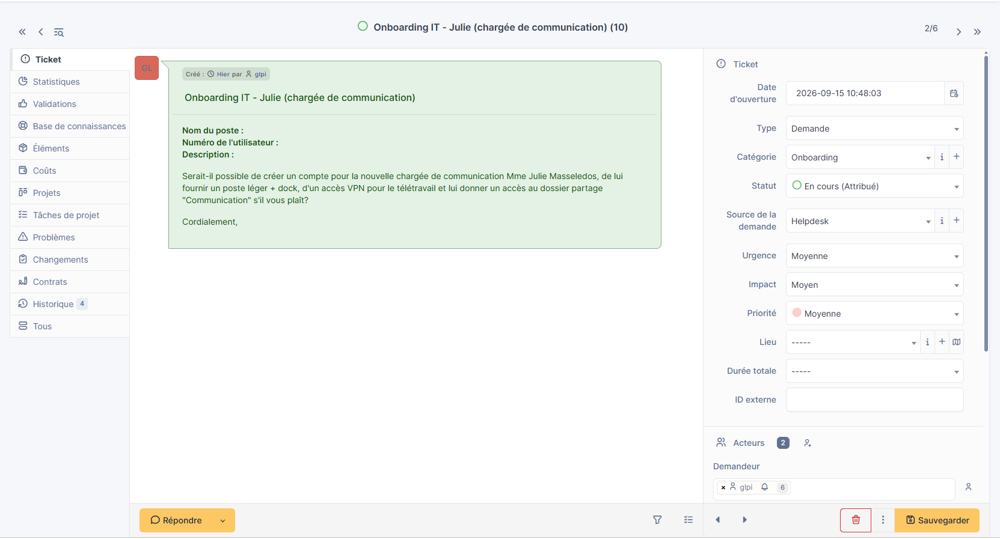

# Compte rendu — « Une journée chez NORTEK SI »

Auteur : Simon — technicien support IT (TP ITIL / GLPI)

Ce document reprend, pour chaque phase, les choix effectués dans GLPI et leur justification. Les **captures d'écran** des manipulations finales sont placées sous le paragraphe de chaque phase et stockées dans le dossier [`images/`](./images).

> Convention : `<!-- CAPTURE : ... -->` (invisible sur GitHub) rappelle ce que doit montrer l'image ; la légende en italique sous l'image est visible.

---

## Configuration préalable — SLA

Avant le traitement, les SLA ont été définis dans un SLM rattaché à un **calendrier heures ouvrées** (lun–ven 8h–18h), la DSI n'ayant pas d'astreinte : 4 niveaux (P1 à P4), chacun avec un temps de prise en compte (TTO) et un temps de résolution (TTR).

<!-- CAPTURE : Configuration > Niveaux de services > SLM NORTEK, avec la liste des 8 SLA (P1-TTO/TTR ... P4-TTO/TTR) ET le calendrier "Heures ouvrées NORTEK" visible -->

*Figure 0 : les 4 niveaux de SLA (TTO/TTR) et le calendrier heures ouvrées.*

---

## Phase 1 — Incidents

Les 5 tickets ont été créés puis priorisés via la matrice Impact × Urgence, et traités par priorité décroissante (et non par ordre d'arrivée). Le serveur de messagerie (impact « toute l'entreprise ») est de priorité **Majeure** et passe en premier. L'email suspect a été qualifié comme **incident de sécurité (hameçonnage)** — pas comme un incident technique ni une demande — et traité en deuxième, avant le tableau de bord du DAF pourtant VIP, car un incident de sécurité voit son impact croître avec le temps (propagation, vol d'identifiants). Suivent le DAF (VIP, priorité Haute), l'imprimante (Moyenne, contournement possible) et la souris (Très basse, remplacement trivial). Les SLA associés sont décomptés sur un **calendrier heures ouvrées** (lun–ven 8h–18h) et non en 24/7, la DSI n'ayant pas d'astreinte — un délai ne doit pas courir la nuit ou le week-end.

<!-- CAPTURE : Assistance > Tickets, vue liste triée par Priorité décroissante, les 5 tickets visibles avec leur priorité. Bien montrer le ticket n°3 catégorisé "Sécurité / Hameçonnage" -->

*Figure 1 : les 5 incidents classés de Majeure à Très basse ; le n°3 est catégorisé « Sécurité / Hameçonnage ».*

---

## Phase 2 — Problème

Le serveur mail étant le 3e incident similaire en deux semaines, un **Problème** a été créé et les 3 incidents lui ont été rattachés. La méthode des **5 Pourquoi** remonte de la coupure du service jusqu'à la cause racine : une tâche de purge des journaux devenue inopérante à cause d'un défaut de la version logicielle, saturant la partition disque. Un **workaround** (purge manuelle, extension de partition, supervision disque à 80 %) supprime les coupures en attendant la correction. La cause connue et son contournement ont été publiés en **KEDB**.

<!-- CAPTURE 1 : fiche Problème #2001, onglet "Tickets" montrant les 3 incidents mail liés -->

*Figure 2a : le Problème et les 3 incidents rattachés (onglet « Tickets »).*

<!-- CAPTURE 2 : Outils > Base de connaissances, l'article KEDB (symptôme/cause/contournement/solution) -->

*Figure 2b : l'entrée KEDB documentant l'erreur connue.*

---

## Phase 3 — Changement

La cause racine impose d'appliquer le **correctif fournisseur**. Une **RFC** a été rédigée (description, risques, impact, rollback par snapshot + sauvegarde, fenêtre de maintenance hors production le mercredi 20h–22h). Classé changement **normal**, il est passé en **CAB** : avis favorable de l'infra, avis favorable **sous conditions** de la sécurité (validation de l'origine du correctif, information des utilisateurs 48 h avant). Le changement est tracé dans GLPI et **lié** au Problème et aux incidents.

<!-- CAPTURE : fiche Changement #3001, onglets "Problèmes" ET "Tickets" montrant les liens vers le Problème #2001 et les incidents -->

*Figure 3 : le Changement relié au Problème #2001 et aux incidents (traçabilité).*

---

## Phase 4 — CMDB

La fiche **CI** de SRV-MAIL01 a été localisée/créée, puis ses **dépendances** documentées dans l'onglet « Analyse d'impact » : annuaire AD, sauvegarde, réseau et pare-feu en amont ; 200 postes clients et notifications applicatives en aval. La **note d'impact** montre qu'une panne du serveur mail affecte l'ensemble des utilisateurs et les notifications, mais pas l'AD ni les fichiers (dont le mail dépend, et non l'inverse) — ce qui cadre le périmètre réel de l'interruption pendant le changement.

<!-- CAPTURE : onglet "Analyse d'impact" de SRV-MAIL01, graphe complet : 4 flèches entrantes (AD, Switch, Pare-feu, Backup) + 2 sortantes (Postes, Applis) -->

*Figure 4 : arbre de dépendances — 4 CI amont impactent SRV-MAIL01, qui impacte 2 CI aval.*

---

## Phase 5 — Demande de service

L'onboarding de Julie a été créé comme **Demande de service** (et non incident) : ce n'est pas une panne mais une demande planifiée issue du catalogue. Les quatre éléments (compte + boîte mail, poste + périphériques, VPN, dossier « Communication ») sont suivis en tâches. Un **SLA de demande** distinct du SLA incident a été appliqué, avec une **date cible** de mise à disposition la veille de l'arrivée (vendredi pour un début le lundi).

<!-- CAPTURE : fiche Demande #4001 : Type = Demande, le SLA de demande, la date cible, et les 4 tâches du catalogue -->

*Figure 5 : la demande de service (Type = Demande), son SLA, sa date cible et les 4 tâches.*

---

## Fil rouge

Les liens GLPI relient les 3 incidents mail → le Problème → le Changement → le CI SRV-MAIL01, la KEDB étant rattachée au Problème. La demande de service de Julie constitue le second fil, indépendant, traité en parallèle. Les figures 2a, 3 et 4 matérialisent cette traçabilité.
